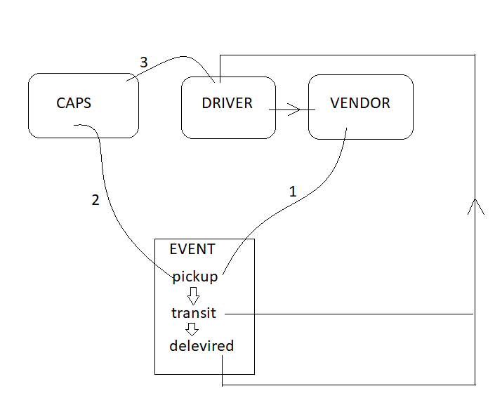
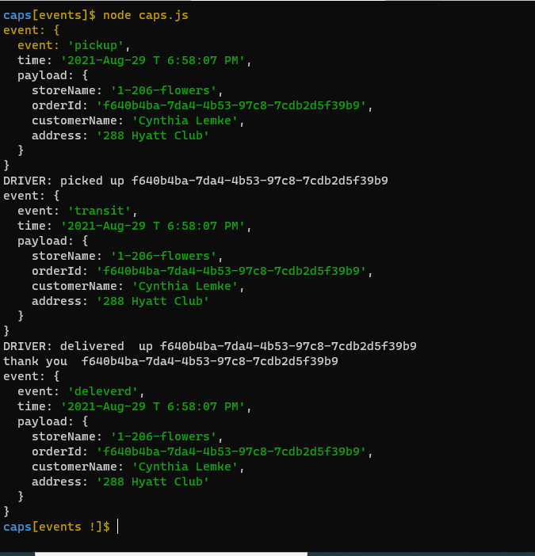

# caps
### Deployment Test

#### Author: siham khaloof

- ##### [Pull Request](https://github.com/sbkhaloof/caps/pull/1)
- ##### [Heroku](https://caps-lab11.herokuapp.com/)

---

###### Setup

### `.env`

> STORENAME=

---

###### Running the app:

- #### `node caps.js` 

- #### Technical Requirements / Notes
  
- `events.js` - Global Event Pool (shared by all modules)
- `caps.js` - Main Hub Application
    - Manages the state of every package (ready for pickup, in transit, delivered, etc)
    - Logs every event to the console with a timestamp and the event payload
    - i.e. “EVENT {}”

`vendor.js` - Vendor Module
- Declare your store name (perhaps in a .env file, so that this module is re-usable)
- Every 5 seconds, simulate a new customer order
    - Create a fake order, as an object:
    - storeName, orderId, customerName, address
- Emit a ‘pickup’ event and attach the fake order as payload
    - HINT: Have some fun by using the faker library to make up phony information
- Monitor the system for events …
    - Whenever the ‘delivered’ event occurs
        - Log “thank you” to the console
        
`driver.js` - Drivers Module
- Monitor the system for events …
- On the ‘pickup’ event …
    - Wait 1 second
        - Log “DRIVER: picked up [ORDER_ID]” to the console.
        - Emit an ‘in-transit’ event with the payload you received
    - Wait 3 seconds
        - Log “delivered” to the console
        - Emit a ‘delivered’ event with the same payload

---
#### execute
    > node caps.js

#### Tests

Unit Tests: `npm run test`
Lint Tests: `npm run lint`

---

#### UML

#### lab result
